# 하차하자

## 2017 DSM 소프트웨어 공모전에서 금상을 수상한 프로젝트 

버스 하차 시스템을 개선하는 Iot프로젝트.

기존의 시내버스 승하차 시스템에서 생기는 여러 문제들을 개선하기  
위해 새로운 버스 단말기와 어플리케이션을 개발하여 문제를 해결하는 프로젝트다.  

전반적으로 NFC모듈과 안드로이드 스마트폰 기기에 있는 HCE와 블루투스를 활용하여 기능을 구현하였다.  
또한, 개발 과정에서 시내버스의 기존 시스템에서 많이 벗어나지 않도록 주의하였다.

HCE와 NFC모듈과의 통신으로 출발지와 목적지를 분명하게 서버에게 전달하여  
목적지 바로 전 정류장이 지난 후 벨이 울릴 수 있게 한다.  
혹여 사용자가 목적지를 놓치는 것을 막기 위해 블루투스를 통해 스마트폰으로 알람을 울려준다.  

특히, 기존에 버스를 타는 것처럼 교통카드를 찍는 시스템에  
서버 연동과 알림 기능을 추가하여 사용자 편의를 고려한 것이므로, 시내버스의 기존 시스템과도 크게 다르지 않다. 

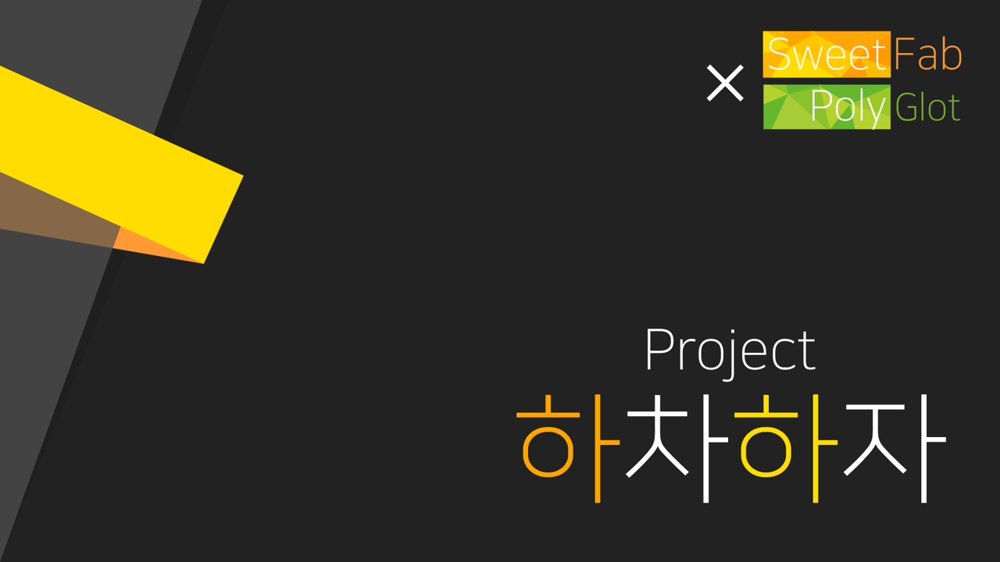

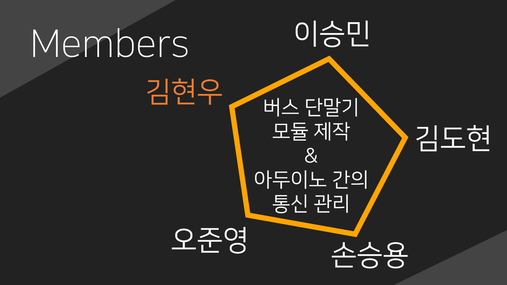

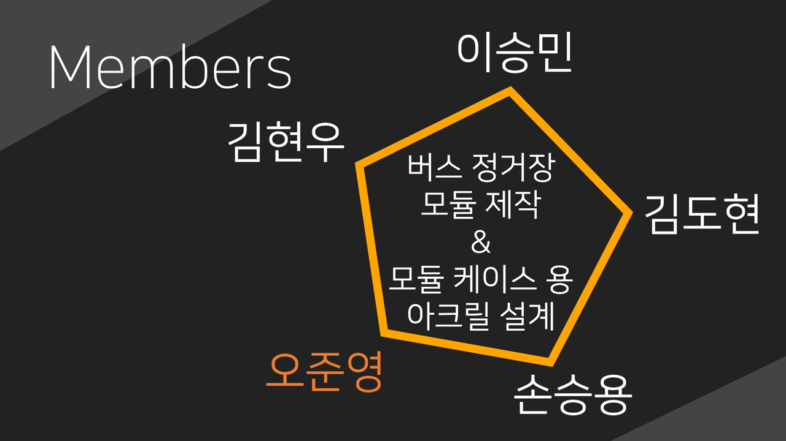

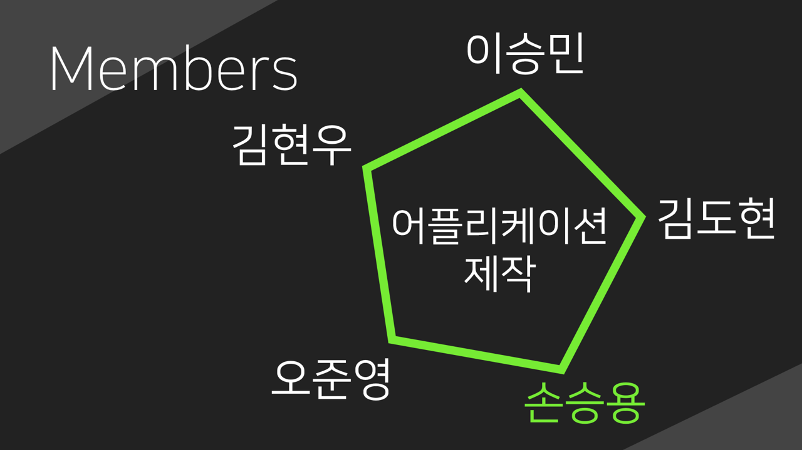

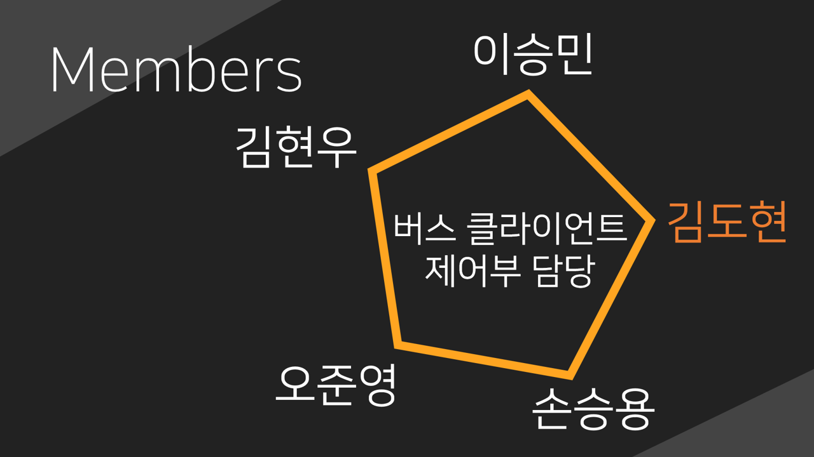

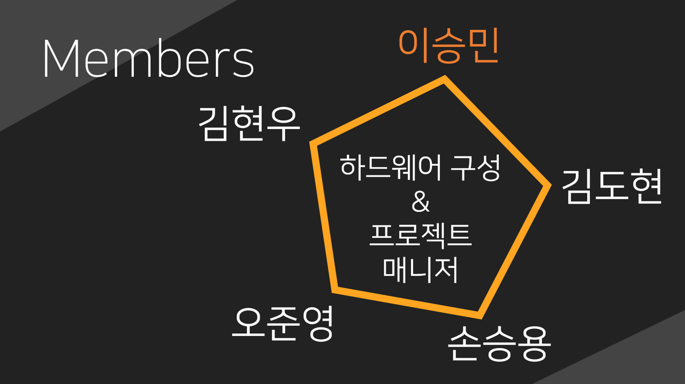

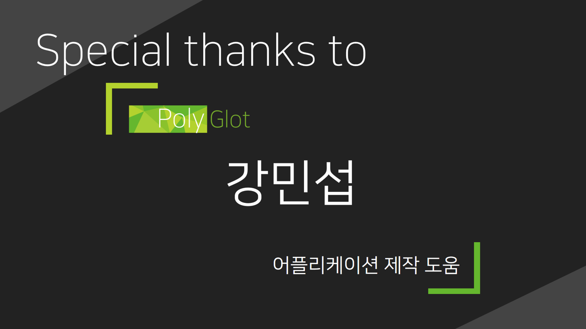

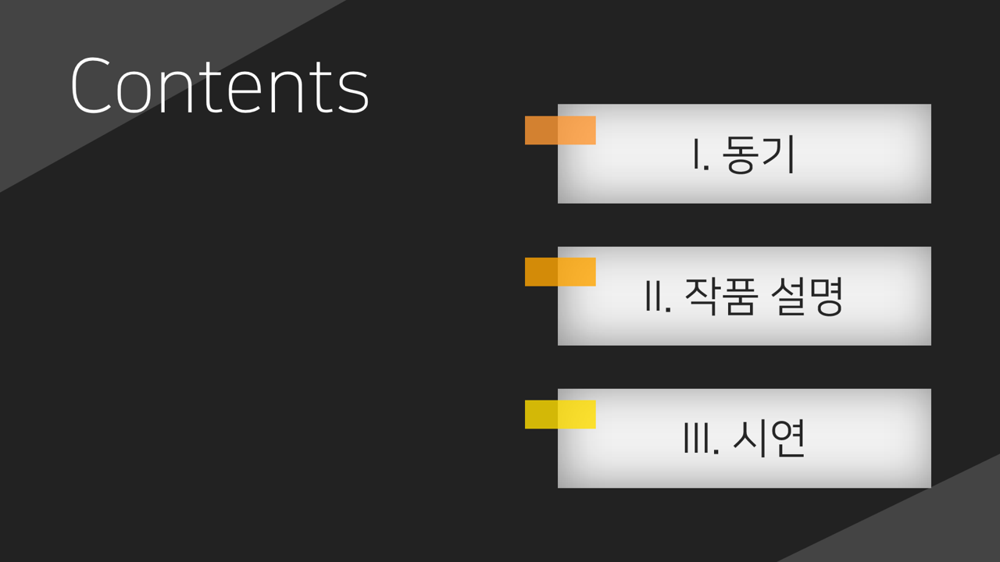

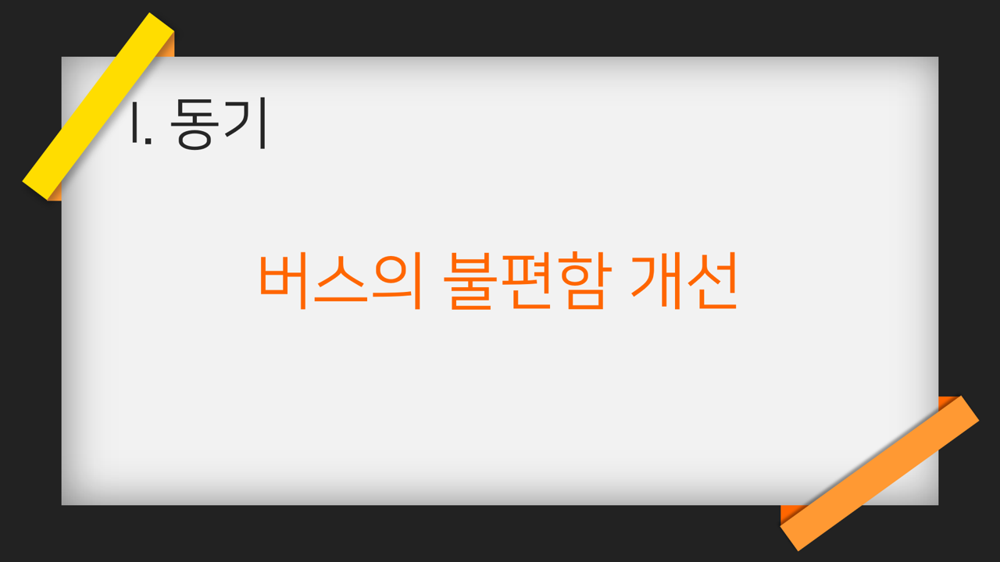

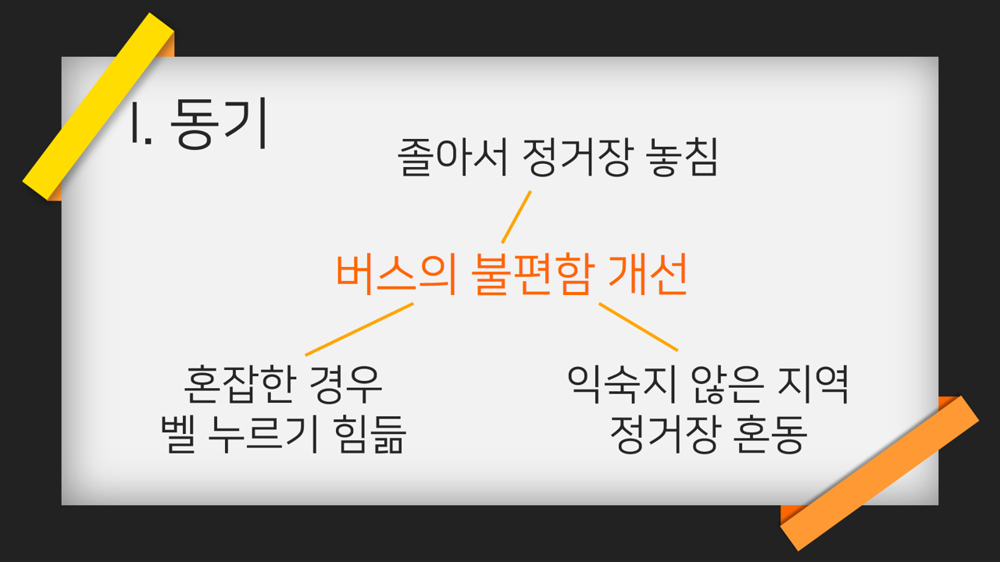

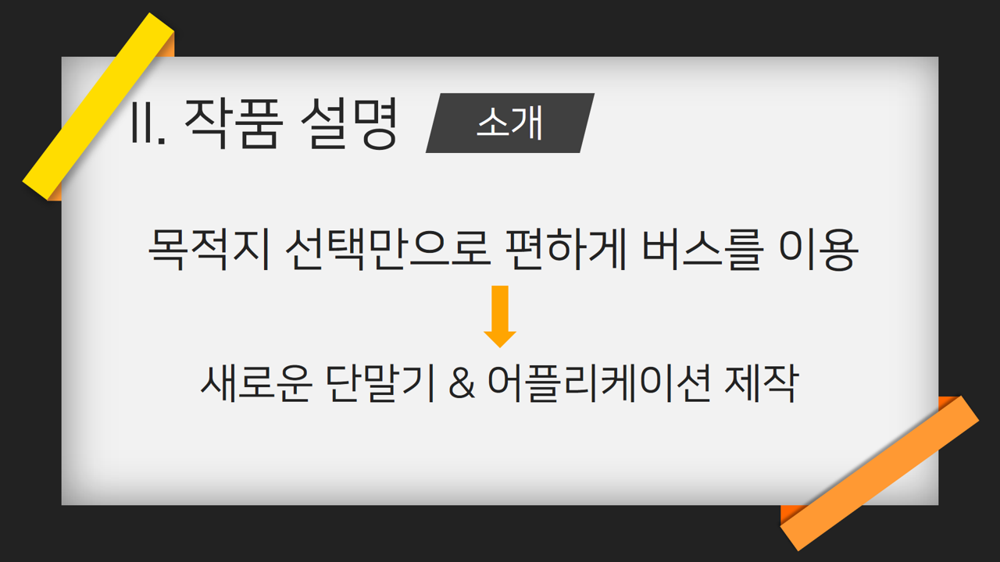

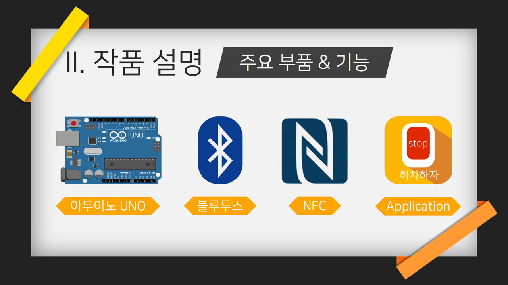

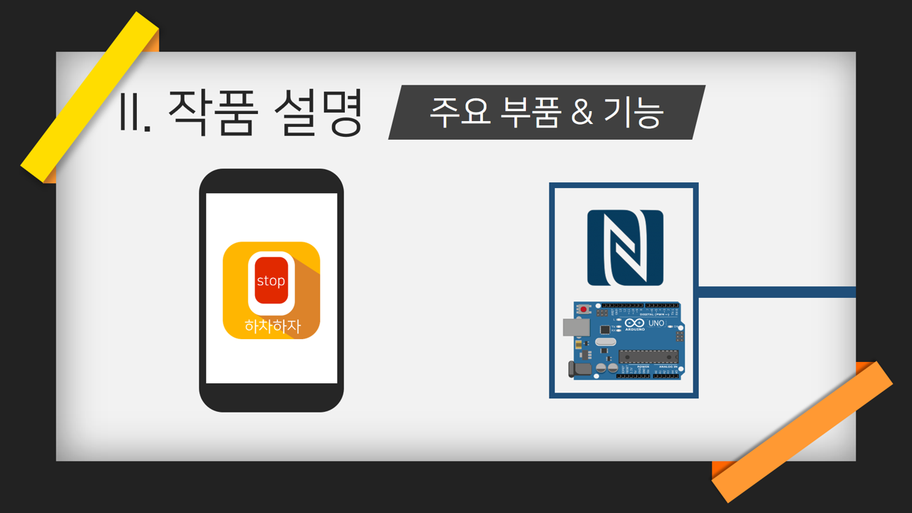

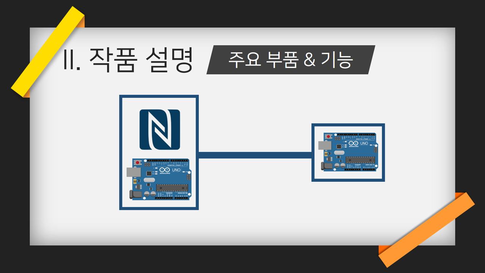

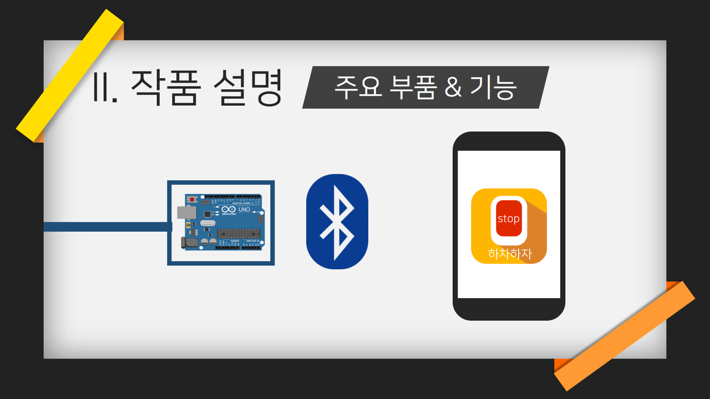

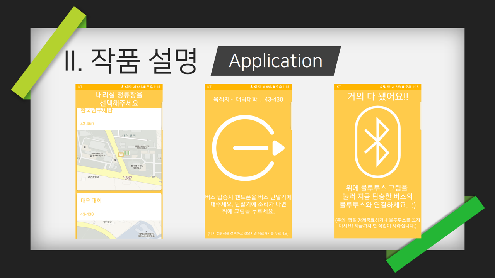

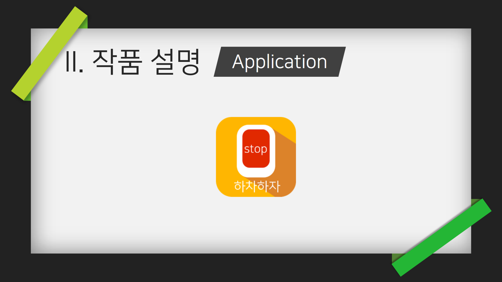