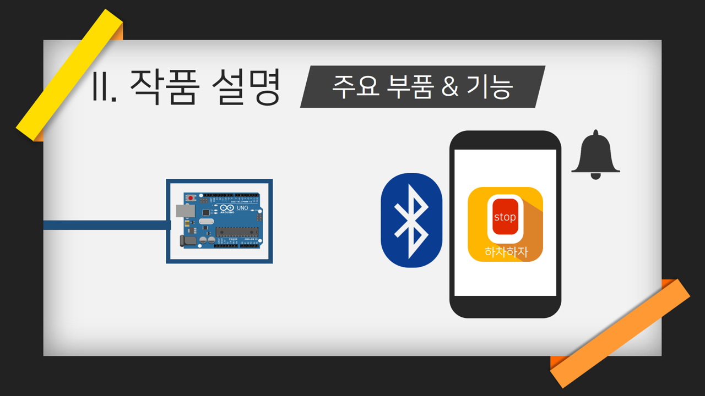

# 하차하자

## 2017 DSM 소프트웨어 공모전에서 금상을 수상한 프로젝트

버스 하차 시스템을 개선하는 Iot프로젝트.

기존의 시내버스 승하차 시스템에서 생기는 여러 문제들을 개선하기  
위해 새로운 버스 단말기와 어플리케이션을 개발하여 문제를 해결하는 프로젝트다.  

전반적으로 NFC모듈과 안드로이드 스마트폰 기기에 있는 HCE와 블루투스를 활용하여 기능을 구현하였다.  
또한, 개발 과정에서 시내버스의 기존 시스템에서 많이 벗어나지 않도록 주의하였다.

HCE와 NFC모듈과의 통신으로 출발지와 목적지를 분명하게 서버에게 전달하여  
목적지 바로 전 정류장이 지난 후 벨이 울릴 수 있게 한다.  
혹여 사용자가 목적지를 놓치는 것을 막기 위해 블루투스를 통해 스마트폰으로 알람을 울려준다.  

특히, 기존에 버스를 타는 것처럼 교통카드를 찍는 시스템에  
서버 연동과 알림 기능을 추가하여 사용자 편의를 고려한 것이므로, 시내버스의 기존 시스템과도 크게 다르지 않다. 

이 프로젝트는 안드로이드를 생전 모르던 나의 생애 첫 번째 프로젝트다.  
나는 프로젝트에서 어플리케이션 개발은 맡았고 나는 그때 안드로이드를 시작한지 한달도 안됬던 상황이었다.  
나는 안드로이드를 공부하면서 어플리케이션을 개발을 해야했고 설상가상으로 팀원들도 그렇게 경험이 있지 않았다.  
~~(그래서 앱의 UI와 소스코드들도 흠이 많다.... 기회가 된다면 다시 UI 짜고 소스코드들도 제대로 짜고 싶다.)~~  
 
결과적으로 우리들은 많은 시행착오들을 겪게되었다...  
우리들은 시행착오를 겪을때 마다 절망감과 지식에 대한 무식함을 느낄 수 있었다.  
하지만 그만큼 우리들은 포기하지 않고 절망감과 무식함에 대해 반성하고 성장했다.  

많은 노력 끝에 프로젝트의 프로토타입이 완성되고 프로토타입을 학교에 제출하게 되었다.  
결과는 좋았고 본선까지 가게되었다. 그러나 기뻐할 시간이 없었다. 본선까지 시간이 별로 없었기 때문이다.    
우리들은 프로토타입에 있는 버그들과 UI를 고칠 시간밖에 없다는 것을 알게되었다.  
그렇게 버그를 고치고 UI를 고친 것이 현재 보고 있는 "하차하자"다.  

우리들은 다시 프로젝트를 제출하고 전교생들과 선생님들 앞에서  
우리가 만든 프로젝트에 대해 발표를 하게되었다. 반응은 좋았고 결과는 금상을 수상하게 되었다.   

포기하지 않고 같이 열심히 작업해준 팀원들에게 고맙다.  

